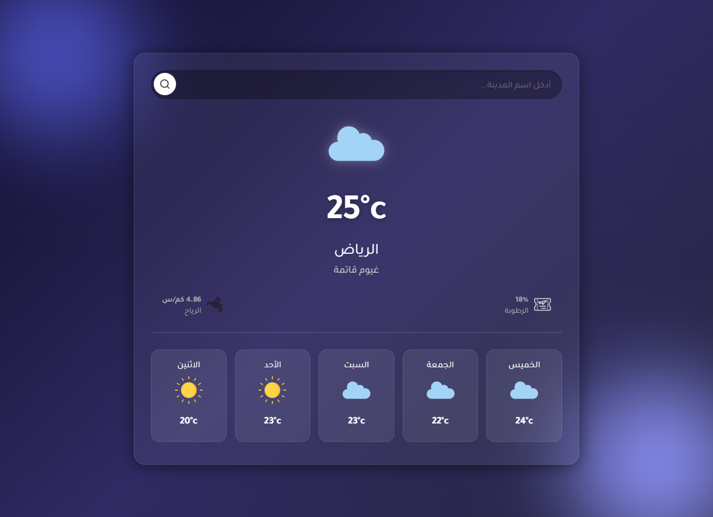

# WeatherApp 🌤️

A responsive web application that provides real-time weather information for any city worldwide. Built with modern web technologies, it features current weather, hourly forecasts, and a 7-day outlook. Users can search for locations, view temperature, humidity, wind speed, and weather conditions in a clean and intuitive interface.

Features:

Real-time weather updates

Hourly and weekly forecasts

Search by city or location

Responsive design for desktop and mobile

Simple, user-friendly interface

Technologies:
HTML | CSS | JavaScript | OpenWeatherMap API

## Features
- Responsive design (works on mobile and desktop)
- Navigation bar
- Clean modern layout

## Live Demo
👉 (https://weather-zg22x.netlify.app/)

## Screenshot

## What I Learned
- How to structure a real company website
- Improving  using JavaScript
- Solving design and spacing problems

## CONTACT HERE

Telegram : @zg22x 

INSTAGRAM : zg22x
